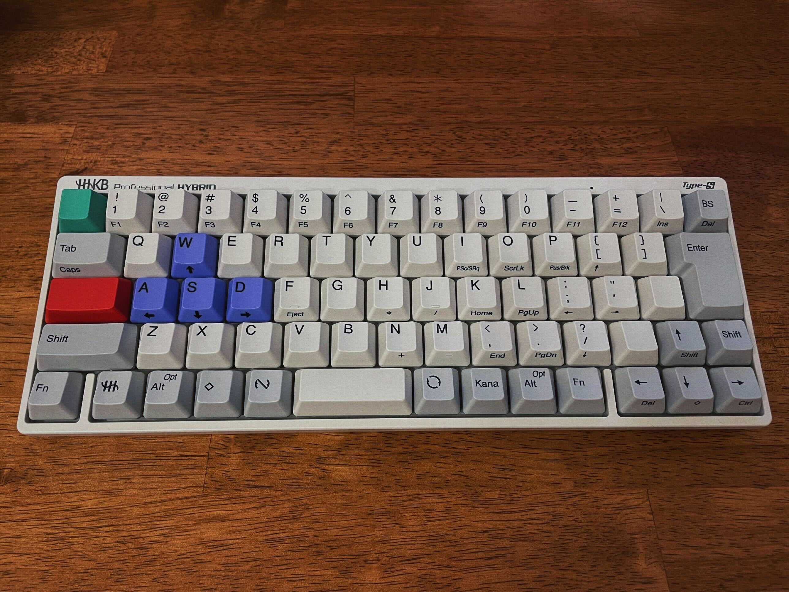
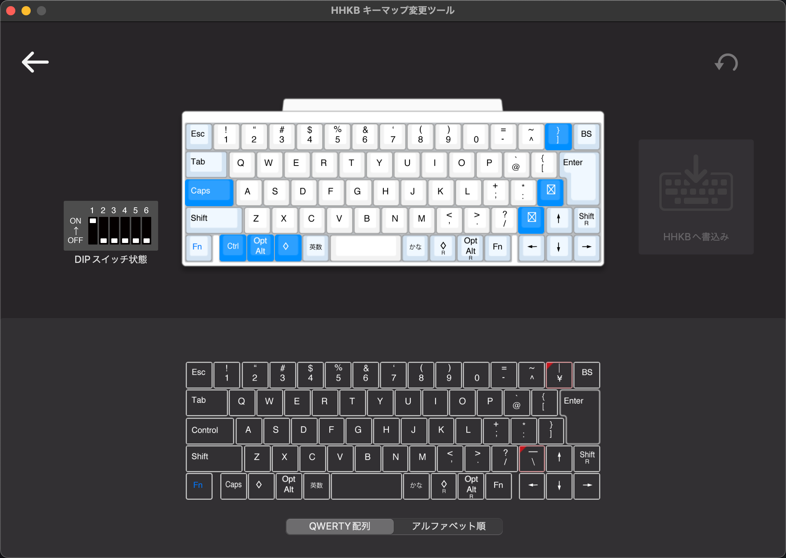
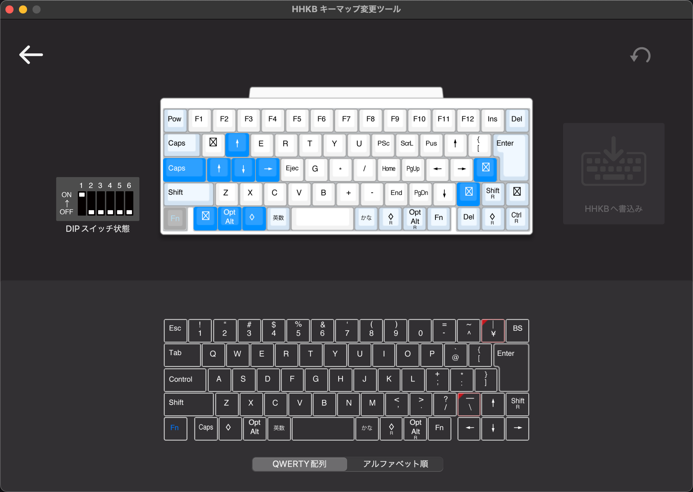

# HHKB-JP-To-ANSI-Layout-Setup

### Final Layout

  

### Keyboard Type Setting

Set functional layout from JIS to ANSI (on Mac):

`System Preferences` -> `Keyboard` -> `Change Keyboard Type`

(`システム環境設定` -> `キーボード` -> `キーボードの種類を変更`)

### Key Top Replacement

|Before (JP)|After (EN)|
|-----------|----------|
|    2 "    |   2 @    |
|    6 &    |   6 ^    |
|    7 '    |   7 &    |
|    8 (    |   8 *    |
|    9 )    |   9 (    |
|    0      |   0 )    |
|    = -    |   _ -    |
|    ~ ^    |   + =    |
|    \| ¥   |   \| \   |
|    ' @    |   { [    |
|    { [    |   } ]    |
|    + ;    |   : ;    |
|    * :    |   " '    |
|    } ]    |Unengraved|
|    _ \    |Unengraved|
|    Esc    |Unengraved|
|  Control  |Unengraved|

\* Swapped the position of `alt` and `command(⬦)`.

### Setup on Official Keymap Tool

#### Keymap

  

#### Keymap (Fn Pressed)

  

\* The tool shows a Japanese layout though the functional layout has been set to ANSI.

Config File:
`/config/HHKB_keymap_tool_setting.hks`

### Problem and Solution

Key `` ` `` and `~` has not been mapped by the above setting, so map
* `` ` `` to `Right Shift` + `Esc`
* ` ~ ` to `Left Shift` + `Esc`

#### Solution on macOS

* [Karabiner-Elements](https://karabiner-elements.pqrs.org/)
* [KE-complex_modifications](https://ke-complex-modifications.pqrs.org/#os-functionality)

Config File:
`/config/left_shift_esc_to_tilde_and_right_shift_esc_to_grave_accent.json`

#### Solution on Windows

* [AutoHotkey](https://www.autohotkey.com/)

Config File:
`/config/autohotkey_mapping.ahk`
